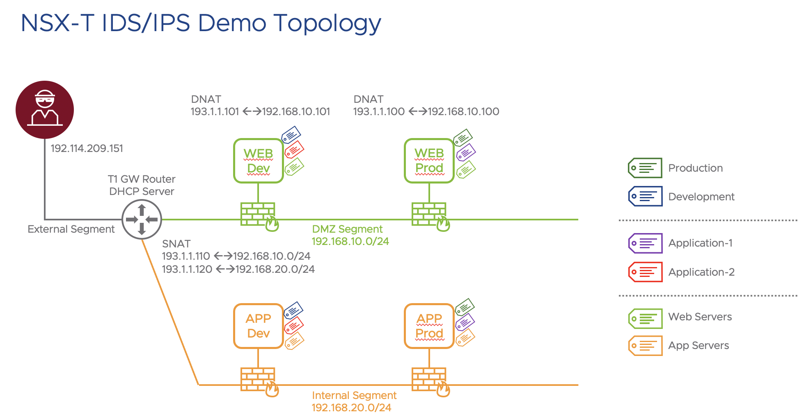

# NSX IDS/IPS Demo/PoC

The provided Terraform script is for demo or PoC purpose ONLY.

The script will automatically create the following NSX objects:
- T1 Gateway, called "T1-GW-IDPS"
- DHCP Server, called "DHCP-Server-IDPS"
- Three (3) segments: External, DMZ and Internal
- Eight (8) differents tags (EXTERNAL, Production, Development, threat, Application-1, Application-2, web-server, app-server)
- Three (3) scopes (Environment, appName, appTier)
- Five (5) Security Groups (IDPS - External, IDPS - Production Applications, IDPS - Development Applications, IDPS - DMZ Segment, IDPS - Internal Segment)
- Five (5) Security policies in the Environment category (IDPS - External Env, IDPS - DMZ Segment, IDPS - Internal Segment, IDPS - Production Environment, IDPS - Development Environment)
- One (1) Security policies in the Application category, called "IDPS - External rules" that gives you SSH access to the Threat VM.

On vSphere side, please adjust the Terraform resources file based on your environment.
Right now, the file uses:
- One (1) datacenter
- Two (2) clusters
- Three (3) datastores
- Two (2) VM templates

The script will automatically create the following objects:
- One (1) VM, called "IDPS-Threat", connected to the NSX "External" segment
- Two (2) VMs, called "IDPS-Web-Dev" and "IDSP-Web-Prod", connected to the NSX "DMZ" segment
- Two (2) VMs, called "IDPS-App-Dev" and "IDSP-App-Prod", connected to the NSX "Internal" segment

# Network Diagram

# Disclaimer and acknowledgements

This lab provides and leverages common pen-test tools including Metasploit as well as purposfully vulnerable workloads built using Vulhub (https://github.com/vulhub/vulhub). Please only use these tools for the intended purpose of completing your demo/PoC, isolate the lab environment properly from any other environment and discard when the demo/PoC has been completed.
